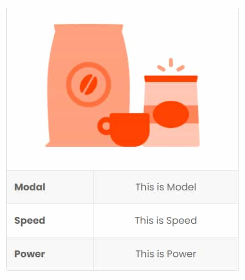

# Markdown & HTML

<details>
<summary><b>WARNINGS</b></summary>

> * You must set `siteUrl` on `gatsby.config.js` it's mendetory for `gatsby-plugin-sitemap` and `gatsby-plugin-robots-txt` to work
> * Make sure to use at least one `line-break` to separate `html` and `markdown` whenever you are using them together
> * Do not `indent` html
> * You have to switch to `markdown` mode when you copy and paste from this documentation 

> * **You shouldn't delete all the `articles` or `affiliate-links` or `tags`. You must have to keep at least one.**
> * **If accidentally delete all of them then here all the examples. Create one and then `commit` & `push`.**

## Article

`/src/pages/article/article-1.md`

```
---
dataKey: articles
title: Article 1
cardTitle: Article 1 card title
description: Article 1 SEO description
slug: article-1
date: 2021-01-01T00:00:00.000Z
tags:
  - tag: tag-1
image: /img/example.png
relatedArticles:
  - article: article-2
---

# Article 1

```

## Affiliate Link

`/src/data/affiliate-links/link-1.md`

```
---
dataKey: affiliateLinks
id: link-1
buttonText: Button Text
link: https://example.com
---
```

## Tag

`/src/data/tags/tag-1.md`

```
---
dataKey: tags
id: tag-1
name: tagname
image: /img/example.png
description: This is SEO description
---
```

</details>


# Utility class

## Simple grid with `2` simple class `row` & `col`
### 2 columns
```html
<div class="row">
<div class="col">

<!-- left column content -->

</div>
<div class="col">

<!-- right column content -->

</div>
</div>
```


### 3 columns
```html
<div class="row">
<div class="col">

<!-- left column content -->

</div>
<div class="col">

<!-- center column content -->

</div>
<div class="col">

<!-- right column content -->

</div>
</div>
```

## To take `text` or any `inline` / `inline-block` to center

```html
<div class="text-center">

<!-- content -->

</div>
```

## There are `3` space utils

### Vertical space (top, bottom)
```html
<div class="v-space">

<!-- content -->

</div>
```

### Horizontal space (left, right)
```html
<div class="h-space">

<!-- content -->

</div>
```
### All side space (top, right, left, bottom)
```html
<div class="space">

<!-- content -->

</div>
```

# Example

## Two column chart

```html
<div class="row">
<div class="text-center col">

@data-chart-value="50"@data-chart-label="50%"

### Free

Goodies 1

Goodies 2

Goodies 3

</div>
<div class="col">

# This is Heading

This is content

</div>
</div>
```


## Three column chart

```html
<div class="text-center row">
<div class="col">

@data-chart-value="25"@data-chart-label="25%"

### Good

Feature 1

Feature 2

</div>
<div class="col">

@data-chart-value="50"@data-chart-label="50%"

### Better

Feature 1

Feature 2

</div>
<div class="col">

@data-chart-value="75"@data-chart-label="75%"

### Best

Feature 1

Feature 2

</div>
</div>
```


## Pros & Cons

```html
<div class="row">
<div class="col">
<div class="pros-header">Pros</div>
<div class="pros-item">Pros 1</div>
<div class="pros-item">Pros 2</div>
<div class="pros-item">Pros 3</div>
</div>
<div class="col">
<div class="cons-header">Cons</div>
<div class="cons-item">Cons 1</div>
<div class="cons-item">Cons 2</div>
<div class="cons-item">Cons 3</div>
</div>
</div>
```


## Two column product

```html
<div class="row">
<div class="text-center col">


<div class="v-space">

@data-link="link-1"

</div>
</div>
<div class="col">

# This is Heading

This is content

</div>
</div>
```


## General Note

```html
<div class="row">
<div class="col">
<h3 class="rate">9/10</h3>
</div>
<div class="col">

### This is the note

@data-link="link-1"

</div>
</div>
```


## Product table

```html
<table>
<tr>
<td colspan="2">


</td>
</tr>
<tr>
<td>Modal</td>
<td>This is Model</td>
</tr>
<tr>
<td>Speed</td>
<td>This is Speed</td>
</tr>
<tr>
<td>Power</td>
<td>This is Power</td>
</tr>
</table>
```



## Table with Green & Blue cell varients

There are `3` types of classes with green & blue varients

1. `green-cell` & `blue-cell`
2. `green-box` & `blue-box`
3. `green-box-cell` & `blue-box-cell`

```html
<table>
<tr>
<td>Modal</td>
<td class="green-box-cell">
<div class="green-box">Top</div>
Model 1
</td>
<td>Model 2</td>
<td class="blue-box-cell">
<div class="blue-box">Best</div>
Model 3
</td>
</tr>
<tr>
<td>Speed</td>
<td class="green-cell">Speed 1</td>
<td>Speed 2</td>
<td class="blue-cell">Speed 3</td>
</tr>
<tr>
<td>Power</td>
<td class="green-cell">Power 1</td>
<td>Power 2</td>
<td class="blue-cell">Power 3</td>
</tr>
</table>
```

